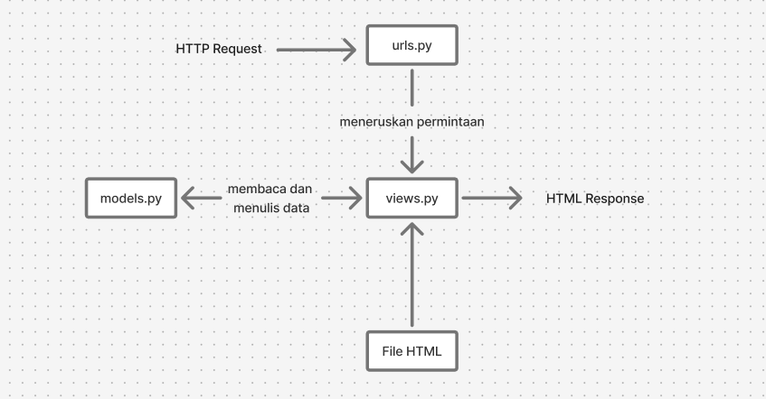

Tautan menuju aplikasi yang sudah di deploy: https://malik-alifan-burhanshop.pbp.cs.ui.ac.id/

1. Jelaskan bagaimana cara kamu mengimplementasikan checklist di atas secara step-by-step
- Pertama, buatlah folder proyek, aktifkan virtual environment, susun requirements.txt, lalu inisialisasi Git dan buat .gitignore agar file sensitif seperti .env dan db.sqlite3 tidak tercommit. 
- Selanjutnya, buat proyek Django dengan django-admin startproject football_shop . , kemudian buat file .env (development) dan .env.prod (production) serta muat variabelnya di settings.py menggunakan python-dotenv.
- Setelah itu, buat aplikasi main, daftarkan di INSTALLED_APPS, dan definisikan model Product dengan enam atribut wajib (name, price, description, thumbnail, category, is_featured), lalu jalankan makemigrations dan migrate. 
- Implementasikan MVT dasar: sebuah view show_main yang me-render template main.html berisi nama aplikasi serta nama dan kelas; petakan rute di main/urls.py dan gabungkan ke burhan_shop/urls.py dengan include. 
- Uji lokal lewat runserver, kemudian buat repo GitHub publik, hubungkan remote, dan push. Terakhir, buat proyek di PWS, copy isi .env.prod ke Environs, tambahkan URL PWS ke ALLOWED_HOSTS, jalankan perintah “Project Command” awal dari PWS, dan untuk berikutnya tinggal melakukan git push pws master dan git push origin master.
    
2. Buatlah bagan yang berisi request client ke web aplikasi berbasis Django beserta responnya dan jelaskan pada bagan tersebut kaitan antara urls.py, views.py, models.py, dan berkas html.

Diagram tersebut menjelaskan alur kerja arsitektur MTV pada Django. Proses dimulai ketika sebuah permintaan HTTP (HTTP Request) masuk dan diterima oleh file URLs (urls.py), yang kemudian meneruskannya ke View (views.py) yang sesuai. View, yang berisi logika, akan berinteraksi dengan Model (models.py) untuk mengakses atau memanipulasi data dari database. Setelah itu, View akan mengirimkan data tersebut ke Template (.html) untuk diolah menjadi halaman yang akan ditampilkan. Hasil akhirnya kemudian dikirim kembali ke pengguna sebagai sebuah respons HTTP (HTTP Response) dalam format HTML.

3. Jelaskan peran settings.py dalam proyek Django!
settings.py adalah file utama yang mengatur semua pengaturan di proyek Django. Di dalamnya ada banyak hal penting, seperti daftar aplikasi yang dipakai (INSTALLED_APPS), pengaturan database, alamat host yang diizinkan (ALLOWED_HOSTS), sampai kunci rahasia (SECRET_KEY). File ini juga dipakai untuk memisahkan pengaturan saat kita bekerja di komputer sendiri (development) dan saat aplikasi sudah dijalankan di server (production). 

4. Bagaimana cara kerja migrasi database di Django?
Migrasi database di Django adalah cara untuk menyesuaikan struktur database dengan model yang kita buat di kode. Saat kita menambahkan atau mengubah model, Django tidak langsung mengubah database. Pertama, kita harus menjalankan perintah python manage.py makemigrations. Perintah ini membuat file migrasi, yaitu instruksi perubahan struktur database sesuai model terbaru. Setelah itu, kita jalankan python manage.py migrate untuk benar-benar menerapkan perubahan ke database. 

5. Menurut Anda, dari semua framework yang ada, mengapa framework Django dijadikan permulaan pembelajaran pengembangan perangkat lunak?
Menurut saya, framework Django dijadikan permulaan peblejaran pengembangan perangkat lunak karena Django menggunakan arsitektur Model-View-Template (MVT) memisahkan data, logika, dan tampilan, sehingga alur kerja aplikasi web lebih mudah dipahami.

6. Apakah ada feedback untuk asisten dosen tutorial 1 yang telah kamu kerjakan sebelumnya?
Asisten dosen sangat membantu dalam pengerjaan tutorial 1. Asisten dosen mampu membantu ketika terjadi error error yang membingungkan.